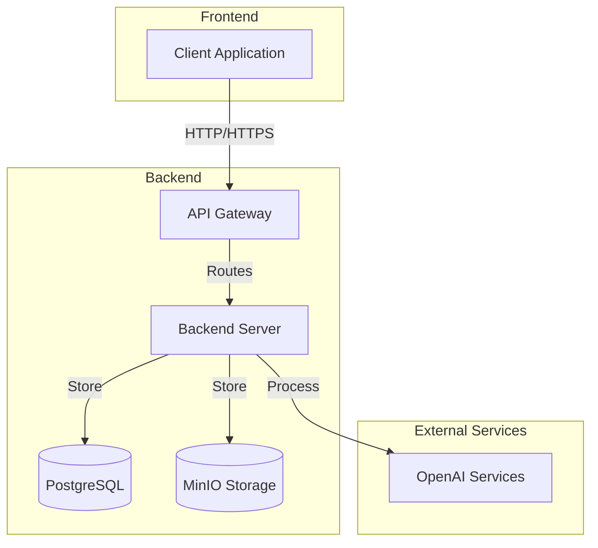
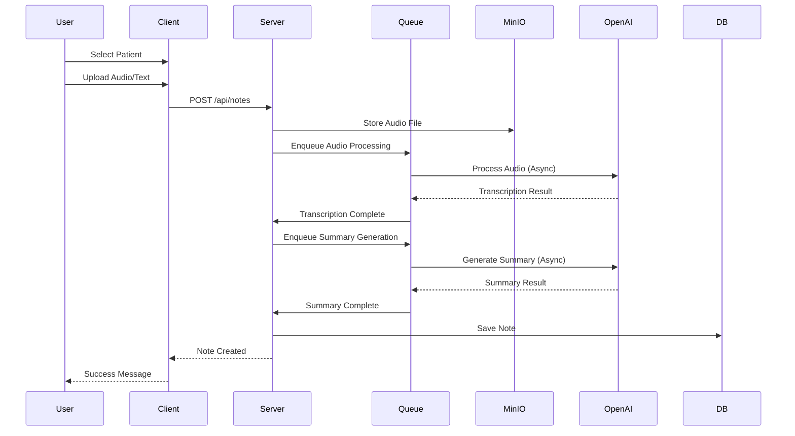
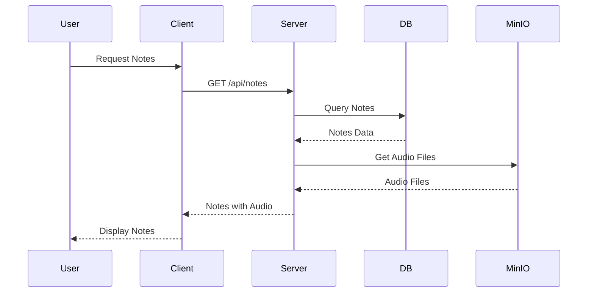
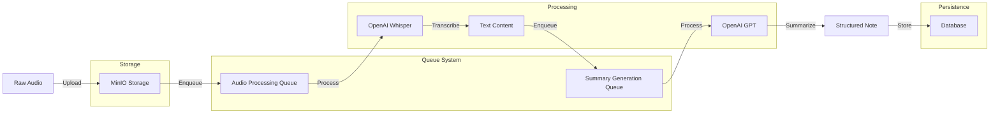

# Medical Notes System Architecture

## Overview
This document outlines the architecture for the Medical Notes System, following Domain-Driven Design (DDD) principles and using modern technologies. The project is organized as a monorepo containing both frontend and backend applications.

### System Overview


### Patient Note Creation Flow


### Note Retrieval Flow


### Data Processing Flow


## Project Structure
```
medical-notes/
├── client/                 # Frontend React Application
│   ├── src/
│   │   ├── components/    # Reusable UI components
│   │   ├── pages/        # Page components
│   │   ├── hooks/        # Custom React hooks
│   │   ├── services/     # API services
│   │   ├── store/        # State management
│   │   ├── types/        # TypeScript types
│   │   ├── utils/        # Utility functions
│   │   └── styles/       # Global styles
│   ├── public/           # Static files
│   └── package.json
│
├── server/                # Backend Node.js Application
│   ├── src/
│   │   ├── application/
│   │   │   ├── commands/
│   │   │   ├── queries/
│   │   │   └── services/
│   │   ├── domain/
│   │   │   ├── entities/
│   │   │   ├── repositories/
│   │   │   ├── services/
│   │   │   └── value-objects/
│   │   ├── infrastructure/
│   │   │   ├── database/
│   │   │   ├── storage/
│   │   │   └── external/
│   │   ├── presentation/
│   │   │   ├── controllers/
│   │   │   ├── middlewares/
│   │   │   └── dtos/
│   │   └── shared/
│   │       ├── errors/
│   │       └── utils/
│   └── package.json
│
├── docker/               # Docker configuration files
│   ├── client/
│   ├── server/
│   └── minio/
│
├── docker-compose.yml    # Development environment setup
├── package.json         # Root package.json for workspace
└── README.md
```

## Technology Stack
- Backend: Node.js with Express
- Database: PostgreSQL
- File Storage: MinIO (S3-compatible)
- Message Queue: Bull (Redis-based)
- Frontend: React (TypeScript)
- API: REST

## Frontend Architecture (client/)

### Core Features
1. **Patient Management**
   - Patient list view
   - Patient detail view
   - Patient creation form

2. **Note Management**
   - Note list view
   - Note creation form
   - Audio upload interface
   - Note detail view

3. **State Management**
   - React Query for server state
   - Context API for UI state

### Component Structure
```
components/
├── common/              # Shared components
│   ├── Button/
│   ├── Input/
│   ├── Modal/
│   └── Table/
├── patient/            # Patient-related components
├── note/              # Note-related components
└── layout/            # Layout components
```

## Backend Architecture (server/)

## Domain Model

### Core Domains
1. **Patient Domain**
   - Patient Entity
   - Patient Repository
   - Patient Service
   - Patient Value Objects (Name, DOB, ID)

2. **Note Domain**
   - Note Entity
   - Note Repository
   - Note Service
   - Note Value Objects (Content, Timestamp)

3. **Audio Domain**
   - Audio Entity
   - Audio Repository
   - Audio Service
   - Audio Value Objects (File, Duration)

### Bounded Contexts
1. **Patient Management Context**
   - Patient registration
   - Patient information management
   - Patient search

2. **Note Management Context**
   - Note creation
   - Note transcription
   - Note summarization
   - Note retrieval

3. **Audio Processing Context**
   - Audio file upload
   - Audio transcription
   - Audio storage

## Application Architecture

### Layers
1. **Presentation Layer**
   - REST Controllers
   - DTOs (Data Transfer Objects)
   - Request/Response handling

2. **Application Layer**
   - Use Cases
   - Command/Query handlers
   - Application Services

3. **Domain Layer**
   - Domain Entities
   - Domain Services
   - Value Objects
   - Domain Events

4. **Infrastructure Layer**
   - Repositories Implementation
   - External Services Integration
   - Database Access
   - File Storage Access

## Database Schema

### Tables
1. **patients**
   - id (UUID)
   - name
   - date_of_birth
   - created_at
   - updated_at

2. **notes**
   - id (UUID)
   - patient_id (FK)
   - content
   - summary
   - created_at
   - updated_at

3. **audio_files**
   - id (UUID)
   - note_id (FK)
   - file_path
   - duration
   - created_at

## File Structure
```
src/
├── application/
│   ├── commands/
│   ├── queries/
│   └── services/
├── domain/
│   ├── entities/
│   ├── repositories/
│   ├── services/
│   └── value-objects/
├── infrastructure/
│   ├── database/
│   ├── storage/
│   └── external/
├── presentation/
│   ├── controllers/
│   ├── middlewares/
│   └── dtos/
└── shared/
    ├── errors/
    └── utils/
```

## External Services Integration

### MinIO Configuration
- Bucket: medical-notes
- Access Policy: Private
- File Structure: /{patient_id}/{note_id}/{filename}

### Queue System (Bull/Redis)
- **Audio Processing Queue**
  - Job: Audio transcription
  - Priority: High
  - Retry Policy: 3 attempts
  - Concurrency: 2 workers

- **Summary Generation Queue**
  - Job: Note summarization
  - Priority: Medium
  - Retry Policy: 3 attempts
  - Concurrency: 3 workers

### OpenAI Integration
- Whisper API for audio transcription
- GPT for note summarization

## Security Considerations
1. Authentication & Authorization
   - JWT-based authentication
   - Role-based access control

2. Data Protection
   - Encryption at rest
   - Secure file uploads
   - Input validation

3. API Security
   - Rate limiting
   - CORS configuration
   - Request validation

## Deployment Architecture

### Development Environment
- Docker Compose for local development
- Hot-reload enabled
- Local MinIO instance

### Production Environment
- Containerized deployment
- Load balancing
- Database replication
- MinIO cluster

## Monitoring and Logging
- Application metrics
- Error tracking
- Performance monitoring
- Audit logging

## Future Considerations
1. Caching strategy
2. Message queue for async processing
3. Microservices split if needed
4. CDN integration for static assets

## Development Workflow

### Local Development
1. **Setup**
   ```bash
   # Install dependencies
   npm install
   
   # Start development environment
   docker-compose up
   ```

2. **Development Scripts**
   ```json
   {
     "scripts": {
       "dev:client": "cd client && npm run dev",
       "dev:server": "cd server && npm run dev",
       "dev": "concurrently \"npm run dev:client\" \"npm run dev:server\"",
       "build": "npm run build:client && npm run build:server",
       "test": "npm run test:client && npm run test:server"
     }
   }
   ```

### Docker Configuration
- Separate Dockerfiles for client and server
- Shared network for service communication
- Volume mounts for development
- Environment variable management

## Deployment Strategy

### Production Build
1. **Client Build**
   - Static file generation
   - Asset optimization
   - Environment configuration

2. **Server Build**
   - TypeScript compilation
   - Dependency optimization
   - Environment configuration

### Container Orchestration
- Docker Compose for production
- Nginx as reverse proxy
- SSL/TLS termination
- Load balancing configuration

